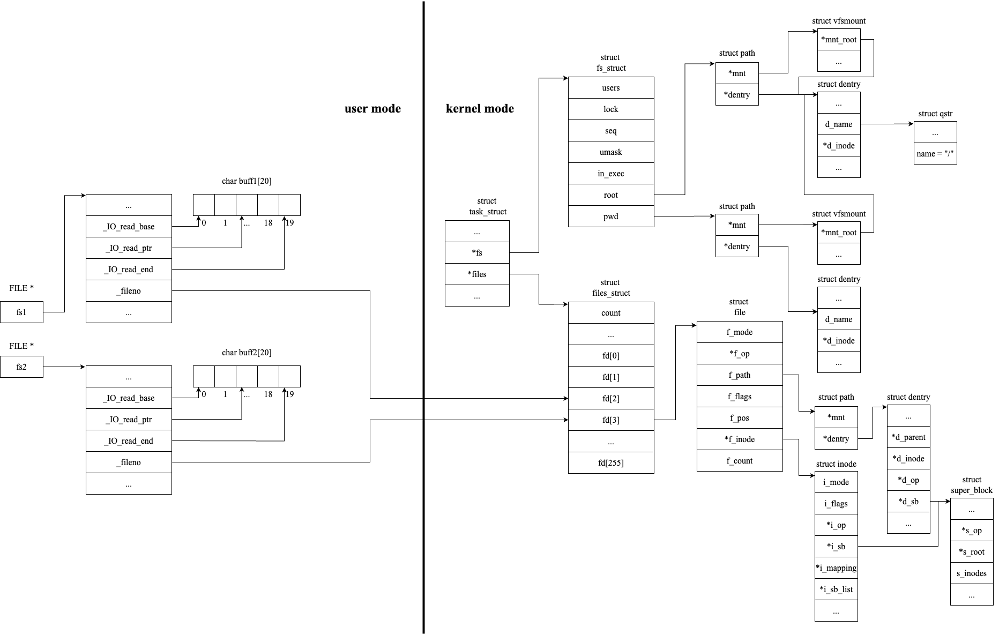
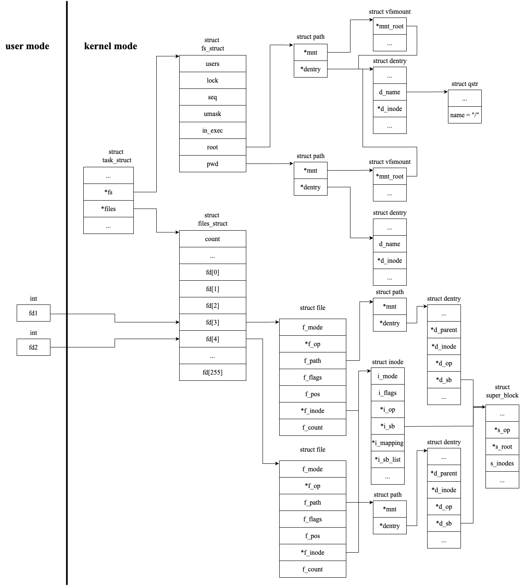

[English](README.md) · [Русский](README.ru.md)

# Буферизованный и небуферизованный ввод-вывод в Linux

Пять программ на языке C демонстрируют связь файлового дескриптора, структуры `file` и индексного дескриптора (`inode`) при разных способах открытия одного файла. По выводу каждой программы видно, какие объекты ядра являются общими, а какие независимыми. Связи структур приведены на рисунках.

Работа выполнена для ядра Linux 6.8. Программы используют вызовы POSIX и собираются также в macOS; приведённый вывод получен при реальном запуске.

## Содержание

- [Структуры ядра](#структуры-ядра)
- [Программа 1. Буферизованный ввод-вывод, чтение](#программа-1-буферизованный-ввод-вывод-чтение)
- [Программа 2. Небуферизованный ввод-вывод, чтение](#программа-2-небуферизованный-ввод-вывод-чтение)
- [Программа 3. Чтение в двух потоках](#программа-3-чтение-в-двух-потоках)
- [Программа 4. Буферизованный ввод-вывод, запись](#программа-4-буферизованный-ввод-вывод-запись)
- [Программа 5. Небуферизованный ввод-вывод, запись](#программа-5-небуферизованный-ввод-вывод-запись)
- [Сборка и запуск](#сборка-и-запуск)
- [Файлы](#файлы)

## Структуры ядра

Файловый дескриптор это индекс элемента массива `fd_array` структуры `files_struct`, доступной из структуры процесса `task_struct`. Элементы с индексами 0, 1, 2 заняты стандартными потоками `stdin`, `stdout`, `stderr`, поэтому первый вызов `open()` возвращает дескриптор 3.

Дескриптор ссылается на структуру `file`. Структура `file` хранит текущее смещение `f_pos` и указатель на индексный дескриптор `inode`. Индексный дескриптор описывает файл и содержит его размер (поле `st_size` структуры `stat`). Несколько структур `file` могут ссылаться на один `inode`.

В пространстве пользователя поток стандартной библиотеки (`FILE *`) надстраивается над дескриптором и добавляет собственный буфер. Таким образом, один открытый файл может разделяться на нескольких уровнях. Каждый уровень показан в отдельной программе.

## Программа 1. Буферизованный ввод-вывод, чтение

Файл `alphabet.txt` открывается один раз (`O_RDONLY`), полученному дескриптору соответствует одна структура `file`. Функция `fdopen()` вызывается для этого дескриптора дважды и возвращает указатели `fs1` и `fs2`. Функция `setvbuf()` задаёт каждому потоку буфер размером 20 байт.



Указатели `fs1` и `fs2` ссылаются на разные структуры `FILE` с разными буферами, но поле `_fileno` у них одно. Поэтому оба потока ведут к одной структуре `file` и поле `f_pos` является общим.

```
aubvcwdxeyfzg
hijklmnopqrst
```

Первый вызов `fscanf()` через `fs1` считывает в буфер первые 20 символов (`a`..`t`) и сдвигает общее смещение `f_pos` на 20. Следующий вызов через `fs2` начинает чтение с позиции 20 и получает оставшиеся символы (`u`..`z` и перевод строки). Затем содержимое буферов поочерёдно выводится функцией `fprintf()`.

## Программа 2. Небуферизованный ввод-вывод, чтение

Файл `alphabet.txt` открывается дважды, возвращаются дескрипторы 3 и 4. Двум вызовам `open()` соответствуют две структуры `file` с независимыми полями `f_pos`; обе ссылаются на один `inode`.



```
aabbccddeeffgghhiijjkkllmmnnooppqqrrssttuuvvwwxxyyzz
```

Смещения изменяются независимо и начинаются с нуля. Чтение выполняется по одному символу поочерёдно через каждый дескриптор, поэтому каждый символ считывается и выводится дважды.

## Программа 3. Чтение в двух потоках

Главный поток создаёт два дополнительных потока и ожидает их завершения. Сам он файл не читает. Каждый дополнительный поток открывает `alphabet.txt`, получает свой дескриптор, читает файл и выводит символы функцией `printf()`. Два вызова `open()` создают две структуры `file` с независимыми полями `f_pos`, поэтому связи структур совпадают с программой 2.

```
ababcdecdefghijfklgmhnijklmonpoqprqsrtsutvuwvxwyxzyz
```

Каждый поток проходит файл со своей позиции, то есть читает его полностью. Планировщик чередует потоки, поэтому два алфавита перемешаны, а порядок символов меняется от запуска к запуску.

## Программа 4. Буферизованный ввод-вывод, запись

Файл `q.txt` открывается дважды функцией `fopen()` в режиме `"w"`, каждому потоку задаётся буфер 20 байт. Нечётные буквы выводятся через `fs1`, чётные через `fs2`. После открытия, каждой записи и закрытия выводится `inode` и размер файла из структуры `stat`.


Данные сначала попадают в буферы стандартной библиотеки (`buff1`, `buff2`) в пространстве пользователя.

```
fopen fs1: inode = 66698169, size = 0 bytes
fopen fs2: inode = 66698169, size = 0 bytes
fprintf: inode = 66698169, size = 0 bytes
fprintf: inode = 66698169, size = 0 bytes
fprintf: inode = 66698169, size = 0 bytes
fprintf: inode = 66698169, size = 0 bytes
fprintf: inode = 66698169, size = 0 bytes
fprintf: inode = 66698169, size = 0 bytes
fprintf: inode = 66698169, size = 0 bytes
fprintf: inode = 66698169, size = 0 bytes
fprintf: inode = 66698169, size = 0 bytes
fprintf: inode = 66698169, size = 0 bytes
fprintf: inode = 66698169, size = 0 bytes
fprintf: inode = 66698169, size = 0 bytes
fprintf: inode = 66698169, size = 0 bytes
fprintf: inode = 66698169, size = 0 bytes
fprintf: inode = 66698169, size = 0 bytes
fprintf: inode = 66698169, size = 0 bytes
fprintf: inode = 66698169, size = 0 bytes
fprintf: inode = 66698169, size = 0 bytes
fprintf: inode = 66698169, size = 0 bytes
fprintf: inode = 66698169, size = 0 bytes
fprintf: inode = 66698169, size = 0 bytes
fprintf: inode = 66698169, size = 0 bytes
fprintf: inode = 66698169, size = 0 bytes
fprintf: inode = 66698169, size = 0 bytes
fprintf: inode = 66698169, size = 0 bytes
fprintf: inode = 66698169, size = 0 bytes
fclose fs1: inode = 66698169, size = 13 bytes
fclose fs2: inode = 66698169, size = 13 bytes
```

Запись в файл выполняется в трёх случаях: буфер заполнен, вызвана `fflush()`, файл закрывается `fclose()`. Тринадцать символов помещаются в буфер 20 байт, поэтому при `fprintf()` файл не изменяется и его размер равен 0. Размер изменяется только при `fclose()`. Индексный дескриптор постоянен, так как файл один. Оба потока открыты в режиме `"w"`, файл усекается, и сохраняются данные последнего сброса (чётные буквы `bdfhjlnprtvxz`). Чтобы не терять данные, второй поток следует открывать в режиме `"a"`.

Номер `inode` относится к данной машине; в Linux значение другое, поведение совпадает.

## Программа 5. Небуферизованный ввод-вывод, запись

Файл `q.txt` открывается дважды (`O_RDWR`). Нечётные буквы записываются через дескриптор `fd1`, чётные через `fd2` системным вызовом `write()`. Размер файла выводится после каждой записи.

```
open: inode = 66695168, size = 0 bytes
write: inode = 66695168, size = 1 bytes
write: inode = 66695168, size = 1 bytes
write: inode = 66695168, size = 2 bytes
write: inode = 66695168, size = 2 bytes
write: inode = 66695168, size = 3 bytes
write: inode = 66695168, size = 3 bytes
write: inode = 66695168, size = 4 bytes
write: inode = 66695168, size = 4 bytes
write: inode = 66695168, size = 5 bytes
write: inode = 66695168, size = 5 bytes
write: inode = 66695168, size = 6 bytes
write: inode = 66695168, size = 6 bytes
write: inode = 66695168, size = 7 bytes
write: inode = 66695168, size = 7 bytes
write: inode = 66695168, size = 8 bytes
write: inode = 66695168, size = 8 bytes
write: inode = 66695168, size = 9 bytes
write: inode = 66695168, size = 9 bytes
write: inode = 66695168, size = 10 bytes
write: inode = 66695168, size = 10 bytes
write: inode = 66695168, size = 11 bytes
write: inode = 66695168, size = 11 bytes
write: inode = 66695168, size = 12 bytes
write: inode = 66695168, size = 12 bytes
write: inode = 66695168, size = 13 bytes
write: inode = 66695168, size = 13 bytes
```

Вызов `write()` не использует буфер в пространстве пользователя, поэтому каждый байт сразу попадает в файл и размер изменяется немедленно (в отличие от программы 4). Два дескриптора имеют независимые поля `f_pos` (связи структур как в программе 2) и начинаются с нуля, поэтому записи перезаписывают друг друга. Размер увеличивается только тогда, когда запись выходит за текущий конец файла. Сохраняются чётные буквы `bdfhjlnprtvxz`. Чтобы не терять данные, файл следует открывать с флагом `O_APPEND`.

## Сборка и запуск

```bash
make        # сборка src/1 .. src/5
make run    # сборка и запуск всех пяти
```

Отдельная программа (запуск из каталога `src`, так как файлы читаются и пишутся рядом):

```bash
cc -Wall -std=c11 src/2.c -o src/2 && (cd src && ./2)
cc -Wall -std=c11 -pthread src/3.c -o src/3 && (cd src && ./3)
```

## Файлы

| файл | назначение |
|---|---|
| `src/1.c` | буферизованное чтение, `fdopen` дважды, общая структура `file` (общее `f_pos`) |
| `src/2.c` | небуферизованное чтение, две структуры `file` (независимые `f_pos`), один `inode` |
| `src/3.c` | чтение в двух потоках, у каждого свой `open` (независимые `f_pos`) |
| `src/4.c` | буферизованная запись, размер изменяется только при сбросе буфера |
| `src/5.c` | небуферизованная запись, размер изменяется немедленно |
| `src/alphabet.txt` | входные данные для программ 1, 2, 3 |
| `img/prog_*.png` | связи структур ядра |
